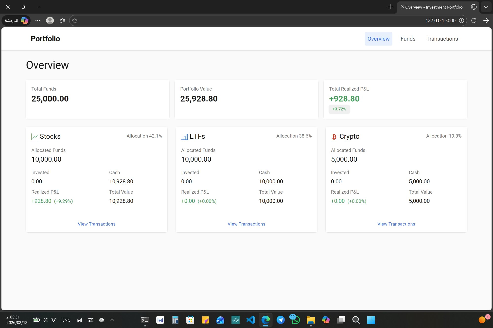
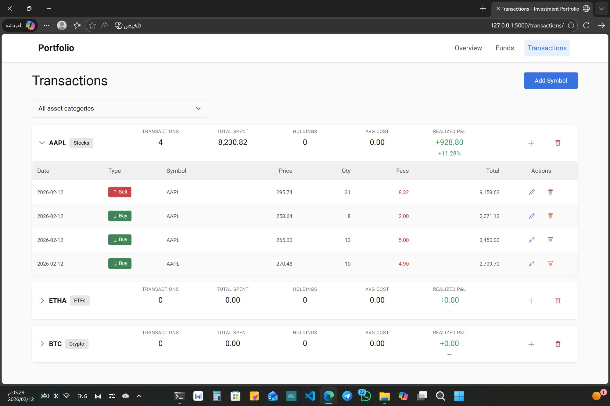
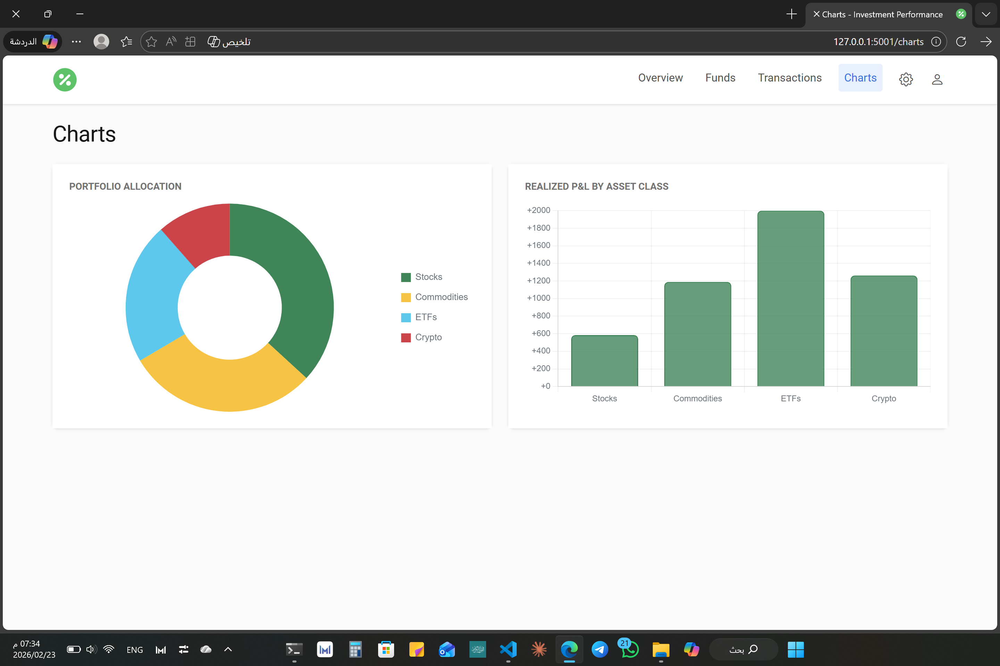
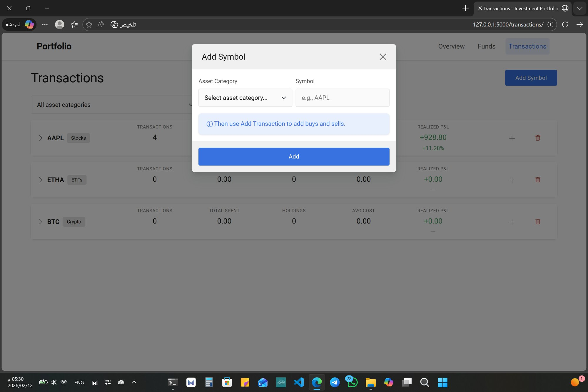
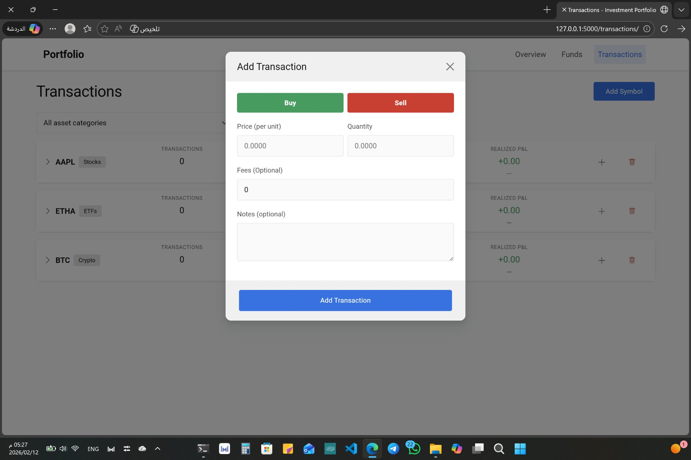
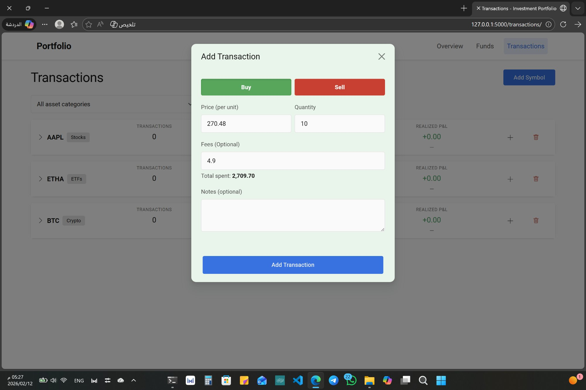
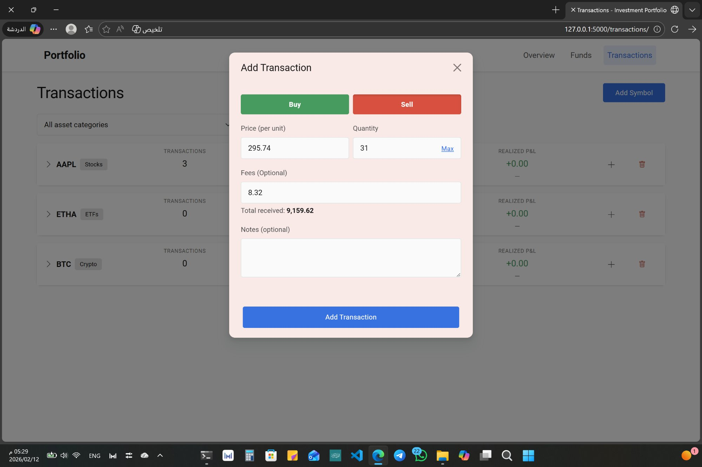

# 📊 Investment Performance Tracker


> A comprehensive web application for managing investment portfolios across multiple asset classes with transaction tracking and realized P&L calculations.

## ✨ Features

- 💰 **Multi-Asset Support**: Track Stocks, ETFs, Commodities, Crypto, and more
- 📈 **Portfolio Overview**: Calculate portfolio value and realized ROI
- 💵 **Fund Management**: Deposit/withdraw funds with complete audit trail
- 🔄 **Transaction Tracking**: Record buy/sell operations with average cost computation
- 📊 **Realized P&L**: Automatic profit/loss calculations on sales
- 🔒 **Flexible Tracking**: No restrictions on buy/sell — negative balances and holdings reflected in calculations
- 🚀 **REST API**: JSON endpoint for portfolio data integration
- 📝 **Manual Entry**: No external APIs - full control over your data

## 🖼️ Screenshots

### Portfolio Overview


### Funds Overview


### Transactions List


### Charts


### Add Symbol


### Add Transaction


### Buy Preview


### Sell Preview


## 🛠️ Tech Stack

- **Backend**: Python 3.8+ with Flask 3.0.0
- **Database**: SQLite with Flask-SQLAlchemy
- **Frontend**: HTML5, Bootstrap 5, JavaScript
- **Testing**: pytest

## 🚀 Quick Start

### Prerequisites

- Python 3.8 or higher
- pip (Python package manager)

### Installation

1. **Clone the repository**
```bash
git clone https://github.com/nasserx/investment-performance-tracker.git
cd investment-performance-tracker
```

2. **Create virtual environment**
```bash
python -m venv venv

# Windows
.\venv\Scripts\activate

# Linux/Mac
source venv/bin/activate
```

3. **Install dependencies**
```bash
pip install -r requirements.txt
```

4. **Run the application**
```bash
python app.py
```

5. **Open your browser**
```
http://localhost:5000
```

## 📚 Usage

### Managing Funds
1. Navigate to **Funds** page
2. Add asset categories with initial funding
3. Track deposits and withdrawals

### Recording Transactions
1. Go to **Transactions** page
2. Add a symbol (e.g., AAPL, BTC)
3. Record buy/sell operations
4. View average cost and realized P&L

### API Access
```bash
curl http://localhost:5000/api/portfolio-summary
```

## 📁 Project Structure

```
investment-performance-tracker/
├── app.py                  # Application entry point
├── config.py               # Configuration settings
├── requirements.txt        # Python dependencies
├── test_app.py             # Test suite
└── portfolio_app/
    ├── __init__.py         # App factory
    ├── models/             # Database models (asset, fund, transaction, ...)
    ├── repositories/       # Data access layer
    ├── services/           # Business logic/services
    ├── calculators/        # Calculation utilities (portfolio, transactions)
    ├── forms/              # WTForms (forms, validators)
    ├── routes/             # Application blueprints/routes
    │   ├── dashboard.py    # Overview & API endpoints
    │   ├── funds.py        # Funds management
    │   ├── transactions.py # Transactions management
    │   └── charts.py       # Charts & visualizations
    ├── utils/              # Utility functions (formatting, http, ...)
    ├── static/             # CSS & JavaScript
    │   ├── css/
    │   │   └── style.css
    │   └── js/
    │       └── main.js
    └── templates/          # HTML templates
        ├── base.html
        ├── index.html
        ├── funds.html
        ├── transactions.html
        └── charts.html
screenshots/                # App screenshots
```

## 🔧 Configuration

Configure via environment variables or `config.py`:

- `SECRET_KEY`: Flask secret key
- `DATABASE_URL`: Database connection string
- `ASSET_CATEGORIES`: Available asset types

**Example:**
```bash
# Windows (PowerShell)
$env:SECRET_KEY = "your-secret-key"
$env:DATABASE_URL = "sqlite:///portfolio.db"

# Linux/Mac
export SECRET_KEY="your-secret-key"
export DATABASE_URL="sqlite:///portfolio.db"
```

## 🧪 Testing

Run the test suite:
```bash
python -m pytest -q
```

Or run the full interactive test script:
```bash
python test_app.py
```

## 🗄️ Database

- **Development**: `portfolio.db` (SQLite)
- **Testing**: `test_portfolio.db`

## 🤝 Contributing

Contributions are welcome! Please feel free to submit a Pull Request.

1. Fork the repository
2. Create your feature branch (`git checkout -b feature/AmazingFeature`)
3. Commit your changes (`git commit -m 'Add some AmazingFeature'`)
4. Push to the branch (`git push origin feature/AmazingFeature`)
5. Open a Pull Request

## 📝 License

This project is licensed under the MIT License - see the [LICENSE](LICENSE) file for details.

## ⚠️ Disclaimer

This project is for educational and organizational purposes only. It does not provide financial advice. Always consult with financial professionals before making investment decisions.

## 🎯 Roadmap

- [ ] Live market price integration
- [ ] CSV import/export functionality
- [ ] User authentication system
- [ ] Multi-currency support
- [ ] Advanced charts and analytics
- [ ] Mobile-responsive design improvements
- [ ] Docker deployment support
- [ ] REST API documentation (Swagger/OpenAPI)

## 👤 Author

**nasserx**

- GitHub: [@nasserx](https://github.com/nasserx/investment-performance-tracker)

## ⭐ Show your support

Give a ⭐️ if this project helped you!

---

Made with ❤️ for the investment tracking community