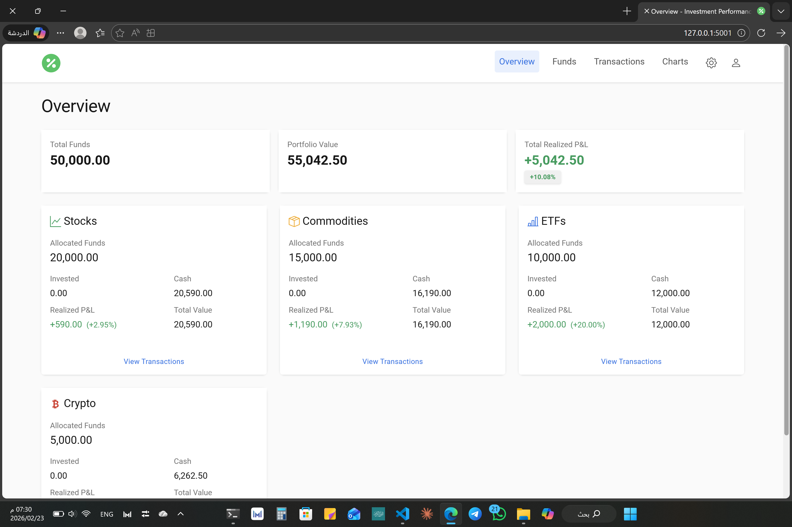
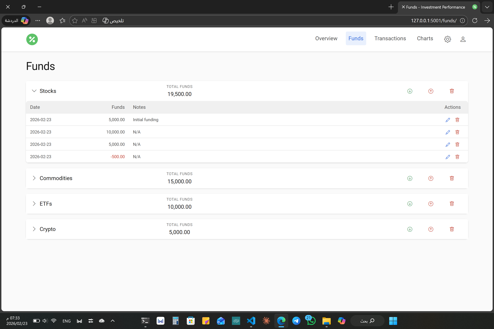
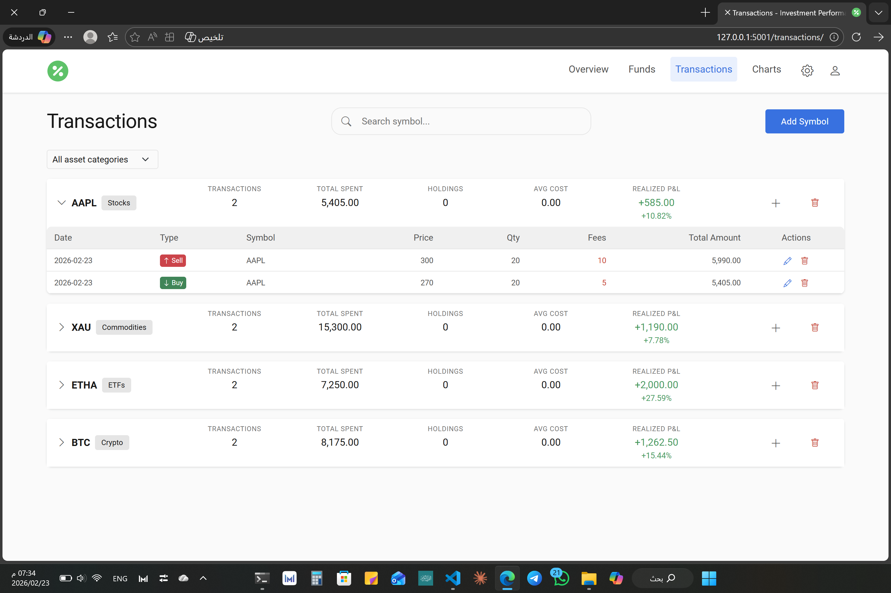

# 📊 Investment Performance Tracker


> A web application for managing investment portfolios across multiple asset classes with transaction tracking, average cost computation, and realized P&L calculations — no external APIs required.

## Table of Contents

- [Features](#-features)
- [Tech Stack](#️-tech-stack)
- [Quick Start](#-quick-start)
- [Usage](#-usage)
- [Screenshots](#️-screenshots)
- [API Reference](#-api-reference)
- [Configuration](#-configuration)
- [Project Structure](#-project-structure)
- [Testing](#-testing)
- [Contributing](#-contributing)
- [Roadmap](#-roadmap)
- [License](#-license)
- [Author](#-author)

## ✨ Features

- 💰 **Multi-Asset Support** — Track Stocks, ETFs, Commodities, Crypto, and more
- 📈 **Portfolio Overview** — Calculate total portfolio value and realized ROI per category
- 💵 **Fund Management** — Deposit/withdraw funds with a complete audit trail
- 🔄 **Transaction Tracking** — Record buy/sell operations with automatic average cost computation
- 📊 **Realized P&L** — Automatic profit/loss calculations on every sale
- 🔒 **Flexible Tracking** — No restrictions on buy/sell; negative balances reflected accurately
- 👥 **Multi-User Auth** — Separate accounts with full data isolation; first user becomes admin
- 🛡️ **Admin Panel** — Manage users, reset passwords, and toggle admin privileges
- 🚀 **REST API** — JSON endpoints for portfolio data integration
- 📝 **Manual Entry** — Full control over your data, no third-party price feeds

## 🛠️ Tech Stack

| Layer | Technology |
|-------|-----------|
| Backend | Python 3.8+ · Flask 3.0.0 |
| Database | SQLite · Flask-SQLAlchemy |
| Frontend | HTML5 · Bootstrap 5 · JavaScript |
| Auth | Flask-Login · Werkzeug password hashing |
| Forms | Flask-WTF |
| Testing | pytest |

## 🚀 Quick Start

### Prerequisites

- Python 3.8 or higher
- pip

### Installation

1. **Clone the repository**
```bash
git clone https://github.com/nasserx/investment-performance-tracker.git
cd investment-performance-tracker
```

2. **Create a virtual environment**
```bash
python -m venv venv

# Windows
.\venv\Scripts\activate

# Linux/Mac
source venv/bin/activate
```

3. **Install dependencies**
```bash
pip install -r requirements.txt
```

4. **Configure environment** (optional)
```bash
cp .env.example .env   # then edit .env with your values
```

5. **Run the application**
```bash
python app.py
```

6. **Open your browser**
```
http://localhost:5000
```

## 📚 Usage

### First Run
1. Open `http://localhost:5000` — you will be redirected to the login page
2. Click **Create one** to register; the first registered account automatically becomes admin
3. Log in and start tracking your investments

### Admin Panel
- Access via the person icon → **Admin Panel** (admin accounts only)
- Reset forgotten passwords and generate temporary passwords for users
- Grant or revoke admin privileges for other accounts

### Managing Funds
1. Navigate to the **Funds** page
2. Create a fund for each asset category (e.g., select "Stocks" or "Crypto")
3. Record deposits and withdrawals to track capital allocation

### Recording Transactions
1. Go to the **Transactions** page
2. Add a symbol (e.g., `AAPL`, `BTC`)
3. Record buy/sell operations with quantity and price
4. The app automatically computes average cost and realized P&L on sales

### Viewing Charts
- Navigate to **Charts** for a visual breakdown of your portfolio allocation and performance

## 🖼️ Screenshots

### Portfolio Overview


### Funds Overview


### Transactions List


### Charts


## 🚀 API Reference

### Get Portfolio Summary

```
GET /api/portfolio-summary
```

**Response:**
```json
{
  "summary": {
    "Stocks": {
      "total_cost": 5000.0,
      "total_value": 6200.0,
      "realized_pnl": 350.0
    },
    "Crypto": {
      "total_cost": 2000.0,
      "total_value": 2800.0,
      "realized_pnl": 120.0
    }
  },
  "total_value": 9000.0
}
```

### Get Held Quantity

```
GET /api/holdings?fund_id=1&symbol=AAPL
```

**Response:**
```json
{
  "fund_id": 1,
  "symbol": "AAPL",
  "held_quantity": "10.5"
}
```

## 🔧 Configuration

Copy `.env.example` to `.env` and adjust as needed:

```bash
SECRET_KEY=your-secret-key-here
DATABASE_URL=sqlite:///portfolio.db
SESSION_COOKIE_SECURE=0   # set to 1 when serving over HTTPS
```

| Variable | Default | Description |
|----------|---------|-------------|
| `SECRET_KEY` | `dev-secret-key` | Flask session signing key — **change in production** |
| `DATABASE_URL` | `sqlite:///portfolio.db` | SQLAlchemy database URI |
| `SESSION_COOKIE_SECURE` | `0` | Set to `1` when serving over HTTPS |

Asset categories and icons are configured in [config.py](config.py).

## 📁 Project Structure

```
investment-performance-tracker/
├── app.py                  # Application entry point
├── config.py               # Configuration settings
├── requirements.txt        # Python dependencies
├── test_app.py             # Test suite
└── portfolio_app/
    ├── __init__.py         # App factory & DB migrations
    ├── models/
    │   ├── user.py         # User model (Flask-Login)
    │   ├── fund.py         # Fund model
    │   └── ...
    ├── repositories/       # Data access layer
    ├── services/
    │   ├── auth_service.py # Register, login, password management
    │   └── ...
    ├── calculators/        # P&L and portfolio calculators
    ├── forms/
    │   ├── auth_forms.py   # Login, register, change password forms
    │   └── ...
    ├── routes/
    │   ├── auth.py         # Login, register, logout, change password
    │   ├── admin.py        # User management (admin only)
    │   ├── dashboard.py    # Overview & API endpoints
    │   ├── funds.py        # Funds management
    │   ├── transactions.py # Transactions management
    │   └── charts.py       # Charts & visualizations
    ├── utils/              # Formatting and helper utilities
    ├── static/
    │   ├── css/style.css
    │   └── js/main.js
    └── templates/
        ├── base.html
        ├── auth/           # Login, register, change password
        ├── admin/          # User management panel
        └── ...
```

## 🧪 Testing

```bash
pytest -v
```

## 🤝 Contributing

Contributions are welcome! Please:

1. [Open an issue](https://github.com/nasserx/investment-performance-tracker/issues/new/choose) first to discuss major changes
2. Fork the repository
3. Create a feature branch (`git checkout -b feature/your-feature`)
4. Commit your changes (`git commit -m 'Add your feature'`)
5. Push and open a Pull Request

Bug reports and feature requests use structured templates to keep things organized.

## 🎯 Roadmap

- [ ] Live market price integration
- [ ] CSV import/export
- [x] User authentication
- [ ] Multi-currency support
- [ ] Advanced charts and analytics
- [ ] Docker deployment support
- [ ] REST API documentation (Swagger/OpenAPI)

## 📝 License

This project is licensed under the MIT License — see [LICENSE](LICENSE) for details.

## 👤 Author

**nasserx** — [@nasserx](https://github.com/nasserx)

---

> ⚠️ **Disclaimer**: This project is for educational and organizational purposes only. It does not provide financial advice. Always consult a qualified financial professional before making investment decisions.
